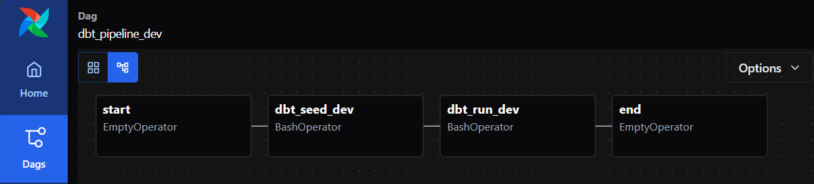
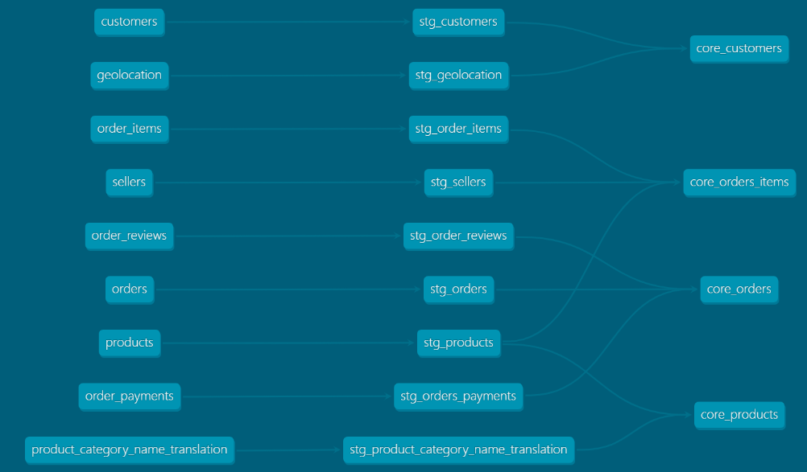

# Projeto Airflow + dbt

Este é um projeto desenvolvido **para praticar conhecimentos em Engenharia de Dados** utilizando **Apache Airflow** e **dbt core**.

## 📦 Sobre o Dataset

Brazilian E-Commerce Public Dataset by Olist  

Este dataset contém informações de 100 mil pedidos realizados entre 2016 e 2018 em marketplaces do Brasil.  
Inclui dados sobre status do pedido, preço, pagamento, frete, localização do cliente, atributos de produtos, avaliações e um dataset de geolocalização com CEPs e coordenadas.   


A arquitetura segue o padrão **raw → staging → core**, equivalente às camadas **bronze → silver → gold** em data lakes:  

- **Raw (Bronze)**: dados crus, vindos diretamente da fonte.  
- **Staging (Silver)**: dados limpos e padronizados.  
- **Core (Gold)**: dados refinados para análise de negócio e dashboards.  

O projeto não é para produção, mas sim um **laboratório de prática**, ideal para aprender a estruturar pipelines de dados modernos.

---

## 🚀 Como configurar e rodar o projeto


### 1. Baixar o CLI AStronomer
### 2. Definir a porta do Postgres (evita conflito com a 5432(postgres) local):  
   
       astro config set postgres.port 5433
            

### 3. Start no projeto e  verificação das dags no airflow porta 8080

        astro dev start
            
Ao rodar é possivel identificar as dags existentes (**dbt_pipeline_dev** e  **dbt_pipeline_prod**) via Airflow UI: http://localhost:8080

   como no exemplo a seguir:
   
 
## 4. Também é possível rodar manualmente cada uma das transformações criadas utilizando o **dbt**.  
   Para isso, siga os seguintes passos:

    4.1. Abra o bash do Astronomer:
   
   &emsp; **astro dev bash**

    4.2. Dentro do bash, entre na pasta projeto1 e execute os comandos do dbt
   
    &emsp; **dbt run --models <models/staging/stg_orders.sql> --target prod**

## 5. Além disso, é possivel rodar os testes, que realizam validações nas tabelas, nesse caso foram explorados testes de completude e unicidade explorando tanto teste que ocorrem com sucesso e outros com falha para explorar o comportamento da ferramenta. 
    ``` 
        astro dev bash
        dbt test --target dev

Exemplo de saida:

        1 of 17 START test not_null_core_customers_customer_id ......................... [RUN]
        23:12:47  1 of 17 PASS not_null_core_customers_customer_id ............................... [PASS in 1.13s]
        23:12:47  2 of 17 START test not_null_core_orders_customer_id ............................ [RUN]
        23:12:47  2 of 17 PASS not_null_core_orders_customer_id .................................. [PASS in 0.13s]
        23:12:47  3 of 17 START test not_null_core_orders_order_id ............................... [RUN]
        23:12:47  3 of 17 PASS not_null_core_orders_order_id ..................................... [PASS in 0.11s]
        23:14:13  14 of 17 START test unique_order_reviews_review_id ............................. [RUN]
        23:14:13  14 of 17 FAIL 789 unique_order_reviews_review_id ............................... [FAIL 789 in 0.83s]

## 6. Por fim, podemos ver as documentação gerada pelo dbt, na qual é possivel ver as tabelas e dependências.
    dbt -- docs generate
    dbt -- docs serve --port 8081 --host 0.0.0.0 --no-browser



##  verificar as tabelas usando psql
psql -h postgres -U postgres -d postgres -p 5432
senha: postgres
listar os schemas do banco: \dn 


### 📂 Tabelas na camada **staging** (`dev_stg`), comando: \dt dev_stg.*

| Schema  | Name                                  | Type  | Owner    |
|---------|---------------------------------------|-------|----------|
| dev_stg | stg_customers                         | table | postgres |
| dev_stg | stg_geolocation                       | table | postgres |
| dev_stg | stg_order_items                       | table | postgres |
| dev_stg | stg_order_reviews                     | table | postgres |
| dev_stg | stg_orders                            | table | postgres |
| dev_stg | stg_orders_payments                   | table | postgres |
| dev_stg | stg_product_category_name_translation | table | postgres |
| dev_stg | stg_products                          | table | postgres |
| dev_stg | stg_sellers                           | table | postgres |

---
### 📂 Views na camada **core** (`dev_core`), comando: \dv dev_core.*

| Schema   | Name              | Type | Owner    |
|----------|------------------|------|----------|
| dev_core | core_customers    | view | postgres |
| dev_core | core_orders       | view | postgres |
| dev_core | core_orders_items | view | postgres |
| dev_core | core_products     | view | postgres |
